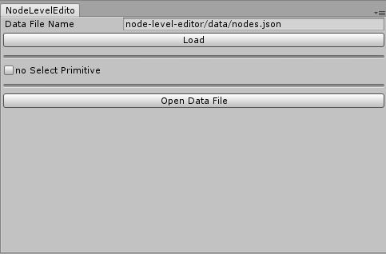
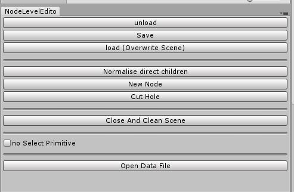
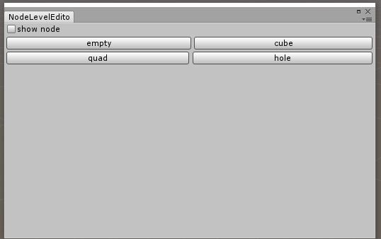
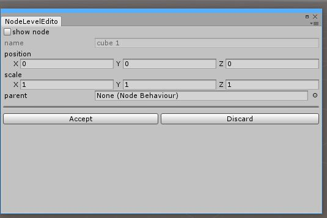
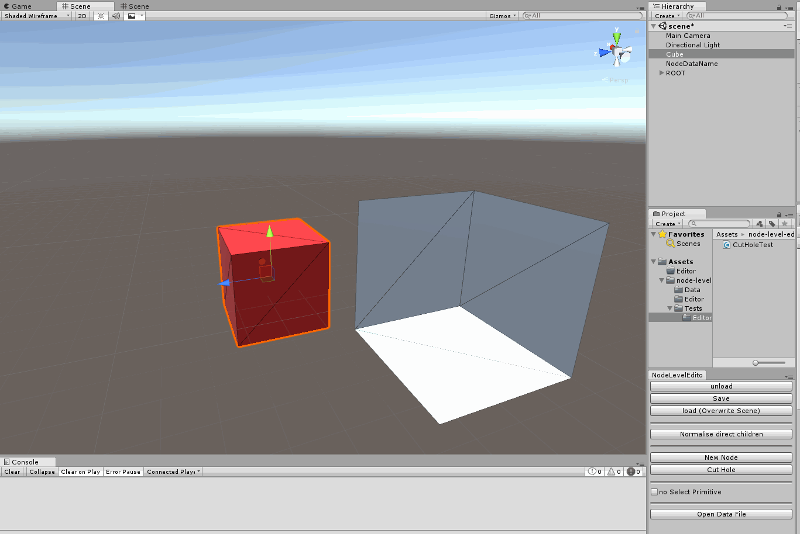
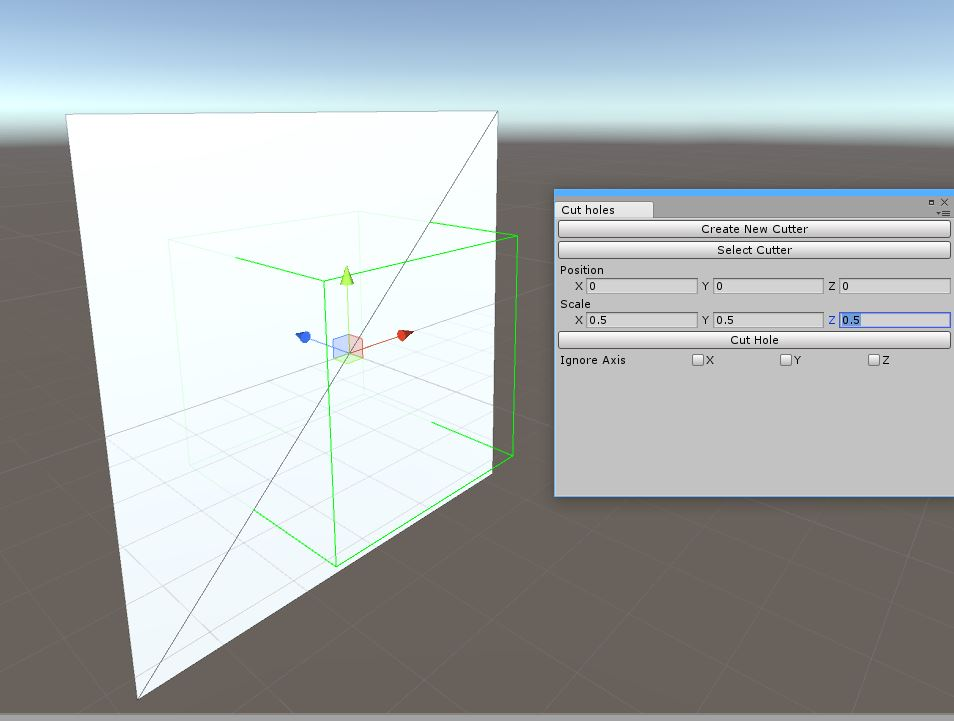

# node-level-editor

Unity3d Editor tools to create rooms quickly. 

These tools are in the beta stage of development, while they should be safe to use in existing scenes it is advised to use them in an new scene to start with.


## Features

* [Install](#install)
    * [Unity Tests](#test)
* [Overview](#overview)
* [Create Nodes](#create)
    * [onNodeCreation Event](#create_event)
* [Create nodes from cubes](#create_cubes)
* [Cut Holes](#holes)
* [JSON data](#json_data)
* [Known Issues and Planned Features](#known_issues)


## Install <a name="install"></a>

Copy code from the source folder to Assets folder in unity project.


### Unity Tests <a name="test"></a>

There are a few tests that can be run by unity to make sure some parts of this project work. Check [here](https://docs.unity3d.com/Manual/testing-editortestsrunner.html) for details on running tests in unity.


## Overview <a name="overview"></a>

This tool was created to help the creating of room based scene in unity. Boxes made of 6 quad facing inwards, and the ability to cut holes in these quads will allow you to prototype levels quickly. 


The scripts save the data about the current nodes in a json file. When you open a scene you can select when where data will be loaded from and saved to. You can also open the data file and edit it manually, details [here](#json_data). The scripts will create a `ROOT` node that will be the default parent of any other node. 



After changes are made to nodes in the scene the save button must be press to make those changes save to the data file. Unloading and reloading will destroy all nodes in the current scene.




## Create Nodes <a name="create"></a>

Pressing the `New Node` button will open a new window that allows you to create a new node.

There are 4 types of nodes:
* Empty nodes are basically empty gameobjects, they can be useful to group other nodes together
* Cube nodes are boxes with 6 inward facing quads
* Quad node are a single gameobject with quad mesh render and collider
* Hole nodes target quad nodes and split then in order to create a hole



Name of nodes needs to be unique so the scripts will set a name based on the type.

The position and scale of the node work the same way as regular transforms in unity expect for holes. For hole nodes the position is the location of the hole relative to the target quad and the scale is the size relative to the target quad.

The Show node button will attempt to show the node you are creating in the scene, this may not work well with hole nodes.

The parent of a node works the same way as regular transforms in unity.

Accepting the node will close the window and add the node to the scene. **The data will still need to be saved**




### onNodeCreation Event <a name="create_event"></a>

When a node is created the `NodeCreator.onNodeCreation` is called by the scripts. This event can be used to do modify the node as it is create. An example of this would be to add a tag to gameobjects created by the scripts.

[Example of event](https://github.com/James-Frowen/node-level-editor/blob/master/EventExamples/NodeLevelEditorEvents.cs)


## Create nodes from cubes <a name="create_cubes"></a>

The Create from cubes window allows level layouts to be quickly created with cubes and then converted to cube nodes.

Set the container to be the parent of the cubes you have create.

When you press create all current nodes in the selected data file are delete and replace when the new nodes.


## Cut Holes <a name="holes"></a>

The cut hole window allows holes to be created in many quads at the same time. It is also a more visual way of creating holes so may be easier than typing in position and scale manually.



A cutter is created by the window and is shown in the scene as a green wireframe of the area that will be cut. The cutter can be moved in the scene or by position and scale field on the window. Quads with normals to different axis can be ignored, for example when the Y axis is ignored you can cut holes in walls without worrying about cutting a hole in the floor.

When the `Cut Hole` button is pressed the quad will be replaced by 4 quad around the hole. When the scene is saved the information to create the hole is stored in the data file and will be recreated on the same quad when ever the data is reloaded.




## JSON data <a name="json_data"></a>

The data for nodes is stored in a JSON format and can be editor manually. If any changes are made to this file the data in the scene will need to be reloaded.

Each node has the same format
```json
{
    "name": "unique name",
    "position": {
        "x": 0.0,
        "y": 0.0,
        "z": 0.0
    },
    "scale": {
        "x": 1.0,
        "y": 1.0,
        "z": 1.0
    },
    "parentName": "",
    "nodeType": "cube"
}
```

The `position` and `scale` are the local scale of this node. The `parentName` is the name of the node that will be set are the parent of this node, this is why it is important that each node has a unique name. The `nodeType` is the type of node to create, this can be one of the following: `empty`, `quad`, `cube` or `hole`.

The data while also contains `nameIndex`, this is the number that will be add to node names to make sure they are unique. It is not a good idea to modify this number


## Known Issues and Planned Features <a name="known_issues"></a>

Known bugs and planned features will be added to [this](https://trello.com/b/juzrW6Ba/node-level-editor) Trello board

If you find a bug while using the tool or just have a suggestion please create a new issue on github or tweet [@JamesFrowenDev](https://twitter.com/JamesFrowenDev) 

